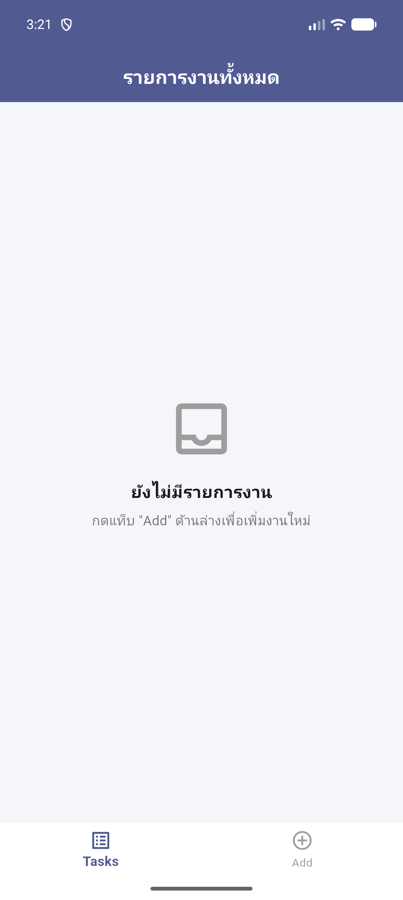
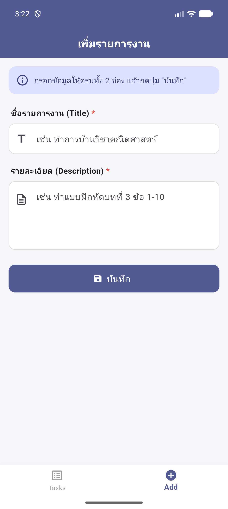
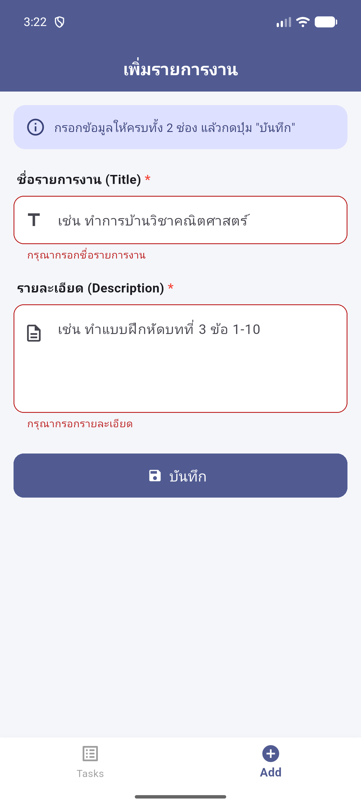
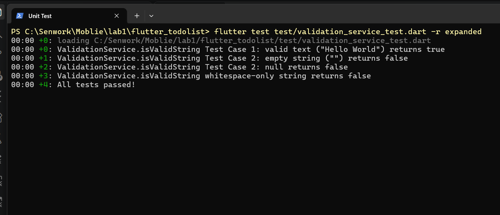

# flutter_todolist

แอป To-Do List ด้วย Flutter + Firebase Firestore (Final Lab 66-131301)

## ฟีเจอร์ตามโจทย์

| ส่วน | รายละเอียด | ไฟล์ |
|---|---|---|
| 1. UI | `Scaffold` + `IndexedStack` + `BottomNavigationBar` (Tasks / Add) | `lib/main.dart` |
| 2. Firebase | บันทึก `title`, `description` ลงคอลเล็กชัน `tasks` และแสดงผลด้วย `ListView` / `ListTile` | `lib/pages/add_page.dart`, `lib/pages/tasks_page.dart` |
| 3. Validation | Title และ Description ห้ามว่าง แสดงข้อความเตือนใต้ `TextField` | `lib/pages/add_page.dart` |
| 4. Unit Test | `ValidationService.isValidString()` ทดสอบค่า `"Hello World"`, `""`, `null` | `lib/validation_service.dart`, `test/validation_service_test.dart` |

## วิธีรัน

```bash
flutter pub get
flutter run
flutter test
```

รันบนเว็บ: ดับเบิลคลิก `run_web.bat` แล้วเปิด http://localhost:8080

## Screenshots ให้ AI แคปจอให้
| Tasks | Add | Validation |
|---|---|---|
|  |  |  |

**Firebase Collection (`tasks`)**

_(รอเพิ่มหลังเปิดใช้งาน Firestore)_

**Unit Tests**


